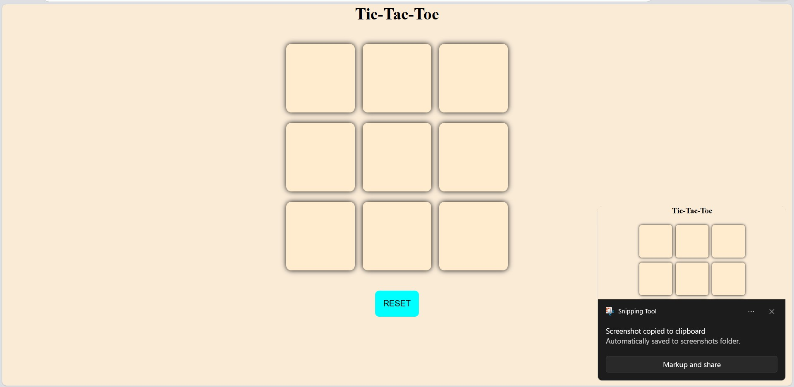

# Tic-Tac-Toe Web Game

A simple interactive Tic-Tac-Toe game built using HTML, CSS, and JavaScript. This project focuses on implementing game logic, DOM manipulation, and user interaction.

## Features
- Two-player gameplay (X and O)
- Real-time winner detection (rows, columns, diagonals)
- Draw detection when the board is full
- Reset and New Game functionality
- Clean and responsive UI

## Tech Stack
- HTML
- CSS
- JavaScript (Vanilla JS)

## How It Works
- Players take turns clicking on the grid
- JavaScript tracks moves and updates the UI dynamically
- Winning conditions are checked after each move using predefined patterns

## How to Run
1. Clone or download the repository  
2. Open `index.html` in your browser  
3. Start playing  

## Project Structure
- `index.html` – Structure of the game  
- `style.css` – Styling and layout  
- `script.js` – Game logic and interactions  

## What I Learned
- Handling user interactions using JavaScript
- Implementing game logic and condition checking
- Manipulating the DOM dynamically
- Structuring a small frontend project

## Demo
(Add your GitHub Pages link here if available)

## Preview
  
